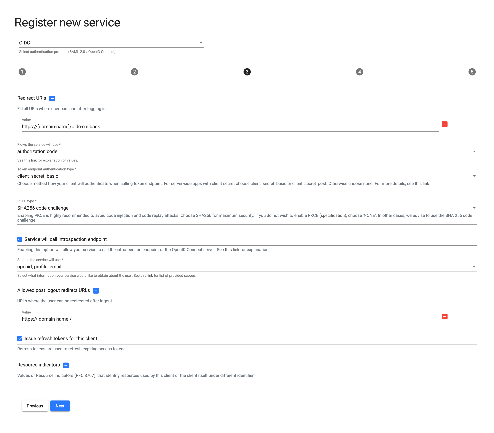

# REMS

[REMS starter kit link](https://github.com/GenomicDataInfrastructure/starter-kit-rems)

## Table of Contents

- [REMS](#rems)
  - [Table of Contents](#table-of-contents)
  - [Interactions with LS AAI](#interactions-with-ls-aai)
  - [Integration](#integration)
    - [Authentication](#authentication)
      - [Registration Form details](#registration-form-details)
    - [GA4GH Visa Issuer](#ga4gh-visa-issuer)

## Interactions with LS AAI

- Authentication into REMS UI via LS AAI
- Providing GA4GH Visas for LS AAI via REMS API

## Integration

This section provides details on how to integrate with LS AAI

### Authentication

The LS AAI provides a login functionality using home organization via its OpenID Connect interface.

The initial step is to register the REMS instance as an OIDC Client into LS AAI. This can be done via submitting a registration form in the [LS AAI Service Provider registration](https://services.aai.lifescience-ri.eu/spreg/).

Note: to register a service you need to have LS an active LS ID. If you do not have one, you can register by following [this guideline](https://lifescience-ri.eu/ls-login/version-2023/user/how-to-get-ls-id.html)

#### Registration Form details

To register REMS into LS AAI, you will need to submit a registration form via the application referenced above.

1. First, log into the application using your LS ID.
2. Open the registration form by choosing `Register new service` from the menu or clicking the corresponding button.
3. From the protocol dropdown, select `OIDC (OpenID Connect)`
4. Fill in the details about the service in the first step
5. In the second step, fill in information about the organization
6. The third step requests you to provide technical information about the integration.
   1. In the `Redirect URIs` specify URLs where the user can be redirected after the login is finished. Usually, you will need to specify the value of `https://[domain-name]/oidc-callback`
   2. From the list of flows select `authorization code`.
   3. The token endpoint authentication method should be set to `client_secret_basic`.
   4. In the PKCE type specify `SHA256 code challenge`.
   5. Tick the box to enable introspection endpoint calls.
   6. From the list of scopes select `openid profile email`.
   7. Specify any location to which the user can be forwarded after the logout procedure into the post-logout redirect URIs field. Usually, this will be the value `https://[domain-name]/`.
   8. Tick the box to allow the issuance of refresh tokens.
   9. The resource indicators field should stay empty for the time being.
7. In the last step, specify access restrictions controlled via LS AAI group membership. Usually, this functionality can stay disabled.
8. Submit the registration form.

When the registration is approved, you will be informed via email. After receiving the confirmation message, log into the application and check the service details. Under the `SAML/OIDC` tab in the details, you will find the `client_id` and `client_secret` credentials for your service. You can now configure REMS to connect to LS AAI. Fill in the credentials in the [configuration file](https://github.com/GenomicDataInfrastructure/starter-kit-rems/blob/main/config.edn#L7-L8). Make any adjustments needed in the properties starting with `oidc-*` if needed.

### GA4GH Visa Issuer

Your REMS instance should act as a GA4GH Visa Issuer for the LS AAI GA4GH Passport Broker. Details about the terminology can be found in the [GA4GH Passports and Visas standard](https://github.com/ga4gh-duri/ga4gh-duri.github.io/blob/master/researcher_ids/ga4gh_passport_v1.md).

To register your REMS as a Visa issuer, contact the LS AAI support at [support@aai.lifescience-ri.eu](mailto:support@aai.lifescience-ri.eu?subject=Registering REMS instance as GA4GH Visa issuer - GDI). In the message, specify that you want to register as a Visa issuer and include the following information:

- **URL for REMS' JSON Web Key Sets (JWKS)** - usually https://\[domain-name\]/api/jwk
- **URL for REMS' endpoint for fetching Passport Visas** - usually https://\[domain-name\]/permissions/{user_id}?expired=false
- **Name of the REMS instance** - the public name of the REMS instance, how it should be displayed if needed

You will be contacted by the LS AAI support team to exchange sensitive integration details, namely to provide credentials for your API endpoint. Usually, the API authentication is done via header and API key (`x-rems-user-id` and `x-rems-api-key`). These will need to be exchanged via a secured channel (e.g. via encrypted email communication).
